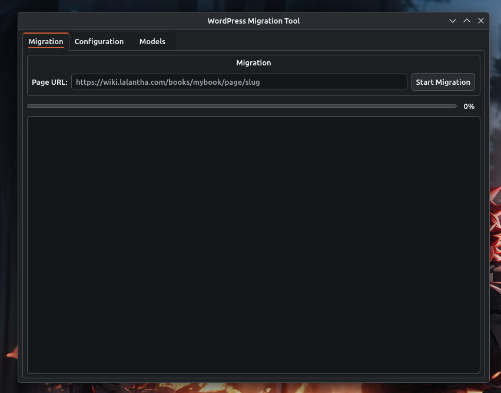

# BookStack to WordPress Migration Tool

A Python tool to migrate pages from BookStack to WordPress with AI-powered content reformatting and featured image generation.



## Features

- Fetch pages from BookStack API
- Clean and reformat content using AI
- Generate featured images with AI
- Upload to WordPress as draft posts
- CLI and GUI interfaces with native Breeze theme

## Quick Install (Automated)

```bash
# Run the installer
chmod +x install.sh
./install.sh
```

The installer will:
1. Check for Python 3.10+ (installs if missing)
2. Install required Python modules
3. Install the application to `~/.local/bin/`
4. Create a desktop shortcut
5. Create default config file

## Manual Installation

### Requirements

- Python 3.10+
- Linux with Breeze theme (KDE) - recommended
- BookStack instance with API token
- WordPress site with application password
- BluesMinds API account (or compatible OpenAI-compatible API)

### Install Dependencies

```bash
pip install requests openai pillow pydantic pyqt6 pyqt6-qt6
```

If pip fails, use:
```bash
pip install --break-system-packages requests openai pillow pydantic pyqt6 pyqt6-qt6
```

### Run

**GUI (recommended):**
```bash
python gui.py
```

**CLI:**
```bash
python cli.py "https://wiki.example.com/books/mybook/page/slug"
```

## Configuration

Settings are stored in `~/.wordpress-migration/config.json`.

Edit the config file and add your credentials:

```bash
nano ~/.wordpress-migration/config.json
```

### Configuration Fields

#### BookStack
- **url**: BookStack instance URL (e.g., `https://wiki.example.com`)
- **token_id**: BookStack API token ID
- **token_secret**: BookStack API token secret

#### WordPress
- **url**: WordPress site URL (e.g., `https://blog.example.com`)
- **username**: WordPress username
- **app_password**: WordPress application password

#### API
- **endpoint**: API endpoint URL (default: `https://api.bluesminds.com/v1`)
- **key**: API key

#### Models
- **text**: Model for content reformatting (default: `openai/gpt-oss-120b`)
- **image**: Model for featured image generation (default: `grok-imagine-image-lite`)

## GUI Usage

The GUI has three tabs:

1. **Migration** (main tab): Enter BookStack page URL and start migration
2. **Configuration**: Set BookStack, WordPress, and API credentials
3. **Models**: Configure AI models for text and image generation

### Desktop Shortcut

The installer creates a desktop shortcut automatically. If using manually:

```ini
[Desktop Entry]
Name=WordPress Migration
Comment=Migrate BookStack pages to WordPress
Exec=/path/to/gui.py
Icon=utilities-terminal
Type=Application
Categories=Development;
Terminal=false
```

Save to `~/.local/share/applications/bookstack-wordpress-migration.desktop`

## CLI Usage

```bash
# Edit credentials in cli.py first
nano cli.py

# Run migration
python cli.py "https://wiki.example.com/books/mybook/page/slug"
```

## How It Works

1. **Fetch**: Retrieves page content from BookStack via API
2. **Clean**: Removes BookStack-specific HTML artifacts
3. **Reformat**: Uses AI to convert wiki content to blog-ready HTML
4. **Generate Image**: Creates a featured image with the post title
5. **Upload**: Uploads image to WordPress media library
6. **Publish**: Creates a draft post with the featured image

## Uninstall

```bash
rm -rf ~/.local/bin/bookstack-wordpress-migration
rm ~/.local/share/applications/bookstack-wordpress-migration.desktop
rm -rf ~/.wordpress-migration
```

## License

MIT
